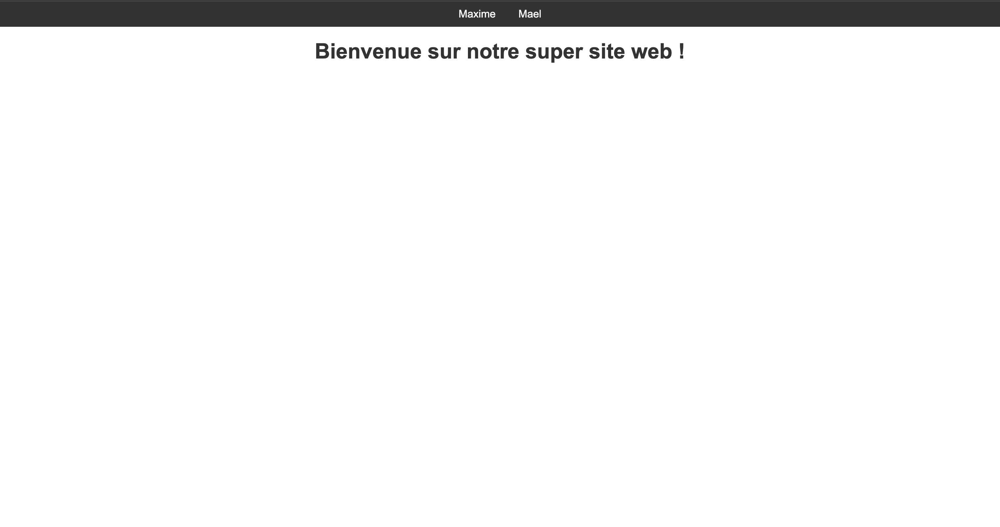

# 🌟 Portfolio Professionnel 🌟

Bienvenue sur le dépôt GitHub de notre portfolio professionnel ! Ce projet a été réalisé dans le cadre d'un exercice pour améliorer nos compétences en **Git**, **HTML** et **CSS**.

## 📋 Table des Matières
- Prérequis et Infos
- Connaissances Travaillées
- Infos
- Rendu
- Références
- Sujet
- Exo
  - Étape 1 : Créer le Repository
  - Étape 2 : Ajout des Données
  - Étape 3 : Mise en Ligne
  - Étape 4 : Mise à Jour
  - Étape 5 : README

## Prérequis et Infos
- **Connaissances travaillées** : Git, HTML, CSS
- **Temps moyen** : 4 heures
- **Taille Équipe** : 2

## Connaissances Travaillées
Cet exercice permet de travailler sur :
- **Git** : gestion de versions, branches, pull requests
- **HTML & CSS** : création de pages web, design épuré

## Rendu
Le rendu doit être sous forme d’un PDF contenant :
- Le titre du projet
- Une liste des membres de l’équipe
- Un lien vers votre repo Git

## Références
- Cours GIT
- Équipes EPSI GIT 2024

## Sujet
Dans le but de parfaire vos connaissances de Git, il vous faudra créer un petit site web hébergé sur GitHub. Pour ce faire, votre équipe devra générer des pages avec des pull requests, et donner ordre à GitHub de publier votre projet. La personne créant le repository sera nommée chef d’équipe.

## Exo

### Étape 1 : Créer le Repository
- Créez un repository sur GitHub.
- Invitez tous les membres de votre équipe en tant que contributeurs.
- Créez une branche supplémentaire appelée `prod`.

### Étape 2 : Ajout des Données
- Chaque membre doit créer une page de présentation personnelle.
- Chaque page doit être créée via une pull request sur la branche `main`.
- Utilisez le même fichier CSS pour toutes les pages.
- Toutes les pages doivent être accessibles depuis l'index.

### Étape 3 : Mise en Ligne
- Le chef d’équipe doit merger la branche `main` avec `prod`.
- Publiez le site en utilisant GitHub Pages à partir de la branche `prod`.

### Étape 4 : Mise à Jour
- Chaque membre doit apporter une modification à sa page via une pull request.
- Une fois toutes les modifications fusionnées sur `main`, mergez `main` avec `prod` à nouveau.

### Étape 5 : README
- Créez un fichier README avec :
  - Une capture d'écran de votre page d'index.
  
  - Les noms de tous les membres de l’équipe : **Maxime** et **Mael**.

---

Merci d'avoir consulté notre projet ! Si vous avez des questions ou des suggestions, n'hésitez pas à nous contacter. 😊